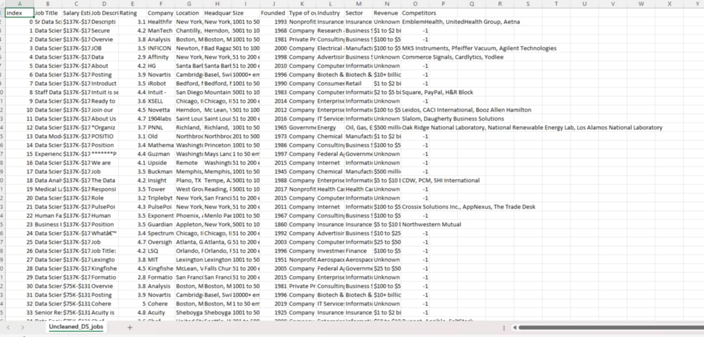

# Data Cleaning and Transformation Using Power Query Editor

# Task Description

- The objective is to clean and transform the "Uncleaned_DS_jobs.csv" dataset using Power Query in Excel. This process ensures the dataset is structured, accurate, and ready for analysis. Key tasks include removing unnecessary characters, extracting and categorizing relevant data, handling missing values, and grouping salary information based on role type, company size, and location.
- Steps Performed in Data Cleaning and Transformation
- Load Data into Power Query – Import the dataset for cleaning and transformation.
- Duplicate Raw Data – Create a copy to maintain an unaltered reference.
- Clean Salary Estimate Column – Remove extra characters to extract only salary values.
- Extract Min and Max Salary – Create separate columns for minimum and maximum salary figures.
- Categorize Job Roles – Add a new column to classify job titles into predefined categories.
- Standardize Location Data – Split and correct location values to ensure consistency.
- Handle Invalid Values – Remove or replace placeholders such as -1 or 0 in relevant columns.
- Refine Company Names – Eliminate extra text like ratings from company names.
- Remove Unnecessary Columns – Drop redundant data that does not contribute to analysis.
- Group by Role Type – Aggregate salary data to analyze trends for different job roles.
- Group by Company Size – Summarize salary trends based on company size.
- Merge State Data – Integrate location details with a state mapping file for consistency.
- Group by State – Compute salary trends based on geographical location.
- Verify Data Integrity – Ensure all transformations are correctly applied and linked.

# 3. Here's the screenshot of my output before I started data cleaning

# 4. Here's the screenshot of my output after I started data cleaning

